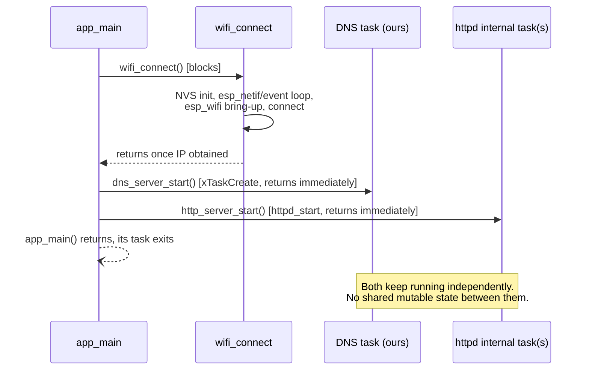

# mini_dns — Architecture

## What this is

`mini_dns` is a proof-of-concept ESP32-S3 firmware: a single device that connects to Wi-Fi, resolves a small hardcoded set of hostnames over DNS (UDP/53), and serves an HTTP page + JSON API showing that same record table. It was built incrementally in 8 verified steps (Wi-Fi → raw UDP → DNS parsing → single-record response → multi-record + NXDOMAIN → HTTP server → JSON API → page wired to the API), each flashed and confirmed on real hardware before moving on.

**This is deliberately not production software.** Records are compile-time constants, read-only after boot. There is no persistence, no provisioning UI, no OTA, no runtime record editing, no auth, and no upstream/recursive DNS resolution. If you're extending this, read the Non-Goals section before adding anything that smells like a "real" feature.

## Target hardware / toolchain

- ESP32-S3, built with ESP-IDF v5.4 (C++17/`gnu++2b`, exceptions and RTTI disabled — see Gotchas).
- Not a git repository as of this writing — no commit history to cross-reference.

## Boot sequence & concurrency model



Three independent runtime pieces exist after boot, with **no synchronization between them** — this is a deliberate simplification, not an oversight, because the only shared data is `DNS_RECORDS`, which is `constexpr` and never mutated after compile time:

1. **Wi-Fi event handling** (`wifi_connect.cpp`) — registered event handlers keep running for the life of the device (auto-reconnect on disconnect), but `wifi_connect()` itself only blocks `app_main` during initial bring-up.
2. **DNS task** (`dns_server.cpp`) — a task we create explicitly via `xTaskCreate`, because raw BSD sockets have no framework driving an accept/receive loop for us.
3. **HTTP server task(s)** (`http_server.cpp`) — `esp_http_server` owns and drives its own task(s) internally; we only configure and start it.

## Component map

| File | Responsibility |
|---|---|
| `main/main.cpp` | Boot sequence: `wifi_connect()` → `dns_server_start()` → `http_server_start()`. |
| `main/wifi_connect.h/.cpp` | Blocking Wi-Fi station bring-up with hardcoded credentials. Retries forever on disconnect (2s backoff), no give-up state. |
| `main/wifi_credentials.h` | `WIFI_SSID`/`WIFI_PASSWORD` constants. **Gitignored** — does not exist on a fresh checkout, must be recreated. |
| `main/dns_records.h` | The hardcoded hostname→IPv4 table (`DNS_RECORDS`, a `constexpr std::array<dns_record_t, N>`). Pure data, no logic, no dependencies beyond `<array>`/`<cstdint>` — intentionally kept dependency-free. |
| `main/dns_server.h/.cpp` | UDP/53 listener in its own FreeRTOS task. Parses the DNS header + question section by hand (no external DNS library), looks up `DNS_RECORDS`, and hand-builds either an A-record response or an NXDOMAIN response. |
| `main/http_server.h/.cpp` | `esp_http_server` bring-up with two routes: `GET /` (static HTML page with an inline `fetch()` script) and `GET /api/records` (JSON array via cJSON). |

## Data flow

**DNS query** (`dns_server.cpp`, single `while(true)` loop in `dns_server_task`):
```
recvfrom()
  → parse_dns_header()          (12-byte header: ID, flags, counts)
  → parse_question_name()       (length-prefixed labels → dotted string;
                                  rejects compression pointers in the question)
  → read qtype/qclass
  → find_dns_record()           (case-insensitive linear scan of DNS_RECORDS)
  → build_a_record_response()   (match + qtype==A)
    or build_nxdomain_response() (no match, or any other qtype)
  → sendto()
```
Every response echoes the request's question section verbatim and reuses a compression pointer (`0xC00C`) back to it, rather than re-encoding the name — the question always starts at byte offset 12, right after the fixed-size header, so that pointer value is always correct.

**HTTP request** (`http_server.cpp`):
- `GET /` → static HTML shell with an inline `<script>` that does `fetch('/api/records')` and renders the result as a table (`textContent`, not `innerHTML`).
- `GET /api/records` → builds a `cJSON` array from `DNS_RECORDS`, serializes with `cJSON_PrintUnformatted`, sends as `application/json`.

## Design decisions & gotchas worth remembering

These are the things most likely to confuse future-you or bite an extension:

- **`RX_BUFFER_SIZE = 512`** (`dns_server.cpp`) — the classic DNS-over-UDP cap without EDNS0. A larger/malformed packet silently truncates on `recvfrom` (no `MSG_TRUNC` handling); acceptable today since there's no parser path that needs to detect truncation, but the first thing to revisit if you ever see mysteriously-wrong parses for large queries.
- **`CONFIG_HTTPD_MAX_REQ_HDR_LEN=1024`** (`sdkconfig.defaults`) — bumped up from ESP-IDF's default of 512. Real browsers (Chrome/Safari, with `Sec-Fetch-*`/`sec-ch-ua*`/cookies/etc.) send header blocks that exceed 512 bytes total and get rejected with HTTP 431 ("Header fields are too long"); `curl`'s minimal headers never hit this, which is why it can look fine under `curl` and still break in a real browser.
- **No upstream/recursive DNS resolution, anywhere** — this device is a *leaf* resolver only. Anything not in `DNS_RECORDS` gets NXDOMAIN, full stop. If a client's DNS is pointed at this device, every other domain (google.com, etc.) stops resolving. This is intentional (explicit non-goal), not a bug, but it's the thing most likely to surprise someone testing this on a real phone/laptop.
- **`.local` hostnames and mDNS** — `DNS_RECORDS` uses `.local` names (matching the original brief's example), but RFC 6762 reserves `.local` for multicast DNS. Client OS resolvers (especially Apple's) intercept `.local` queries and route them to mDNS instead of whatever unicast DNS server is configured — meaning a phone/laptop browser will **never** actually ask this device about a `.local` name, even with its DNS correctly pointed here. Only tools that bypass the OS's special-casing (`dig`, `nslookup`) or genuinely unreserved TLDs (`.loc`, `.test` — see the `laptop.loc` entry) work reliably end-to-end from a browser. If extending the record table for real device access, prefer a non-`.local` TLD.
- **Startup calls use `ESP_ERROR_CHECK`; per-packet/per-request calls use errno + log + continue.** `esp_wifi_*`, `httpd_start`, `httpd_register_uri_handler` are one-shot, `esp_err_t`-returning, startup-time calls — if they fail, there's no meaningful degraded mode, so they panic immediately with a clear file/line. `socket()`/`bind()`/`recvfrom()`/`sendto()` are raw BSD calls returning `-1`/`errno`, called continuously in a loop — a single bad packet or transient send failure is logged and the loop continues, since aborting the whole device over one dropped packet would be wrong. Keep this split when adding new calls rather than picking one style for the whole codebase.
- **Case-insensitive hostname matching** (`ascii_case_insensitive_equal` in `dns_server.cpp`) — DNS names are case-insensitive per RFC 1035 §2.3.3; this was added deliberately at the multi-record step rather than deferred again.
- **NXDOMAIN, not NODATA, for a wrong-qtype match** — querying `AAAA` for `test.local` (which only has an A record) returns NXDOMAIN, not the RFC-correct NODATA (NOERROR + empty answers). A deliberate simplification: implementing real NODATA would require tracking "name exists at all" as a concept separate from "has an A record," for a distinction nothing in this project depends on.
- **`dns_records.h` stays pure data on purpose** — no lookup function lives there. The lookup (`find_dns_record`) lives in `dns_server.cpp` next to the rest of the DNS logic, so the records header never needs to pull in `<string>`/`<optional>` or make a case-sensitivity decision itself.
- **`wifi_credentials.h` is gitignored** — contains real Wi-Fi credentials as `constexpr const char*` values. Does not exist on a fresh clone; must be recreated by hand (see `main/CMakeLists.txt` for the exact symbols it must define: `WIFI_SSID`, `WIFI_PASSWORD`).
- **No automated tests.** All verification so far has been manual and hardware-in-the-loop (flash, `dig`/`curl`/browser, read serial log). This is fine for a POC built step-by-step with a human in the loop, but it's a real gap if this code grows — the wire-format parse/build functions in `dns_server.cpp` (`parse_dns_header`, `parse_question_name`, `build_a_record_response`, `build_nxdomain_response`) are pure functions over byte buffers and are the most natural candidates for host-side unit tests (ESP-IDF bundles the Unity test framework) if that's ever worth adding.

## Explicit non-goals (as scoped)

These were ruled out deliberately, not overlooked — don't reintroduce them without reopening the scoping conversation:

- NVS / LittleFS persistence for records
- Wi-Fi provisioning UI / captive portal
- OTA updates
- Runtime add/edit/delete of DNS records
- Recursive/upstream DNS resolution
- Authentication or access control
- Plugin systems, mDNS responder, metrics, or other "extensibility" hooks
- Heavy C++ (coroutines, modules, template metaprogramming)

## Future scoping

Roughly ordered by how naturally each extends the current design, not by priority:

1. **mDNS responder for real `.local` support.** The current `.local` gotcha (see above) is best solved by actually implementing multicast DNS advertisement (e.g. via ESP-IDF's `mdns` component) rather than fighting client OS behavior — this is a genuinely different mechanism from the unicast resolver already built, and could run alongside it rather than replacing it.
2. **Upstream DNS forwarding for unmatched queries.** Currently a hardcoded leaf resolver; forwarding non-table queries to a real upstream (8.8.8.8, etc.) would turn this into an actually-usable local DNS server/cache instead of something that breaks general internet DNS the moment a client points at it. Non-trivial: needs its own UDP client socket, a way to correlate outstanding upstream queries back to the original client (transaction ID collisions across two independent ID spaces), and a timeout/retry policy.
3. **NVS-backed persistence + a real add/edit/delete API.** Would need input validation (hostname syntax, IP parsing), a storage schema, and probably auth (see below) before it's safe to expose over HTTP. This is the single biggest architectural jump from the current design — `DNS_RECORDS` stops being `constexpr`, and `find_dns_record` needs a mutex or similar since it'd now cross the DNS task / HTTP task boundary as shared mutable state (today there's deliberately none).
4. **`POST`/`PUT`/`DELETE` on `/api/records`**, paired with #3 — natural home for it given the JSON API already exists for reads.
5. **Basic auth** on any endpoint that becomes mutating (#3/#4) — not needed while everything is read-only, becomes necessary the moment editing exists.
6. **AAAA (IPv6) record support** — `qtype_to_string` already recognizes AAAA numerically; actually answering AAAA queries would need IPv6 address storage in `dns_record_t` and a second response-builder path (or a generalized one, if it doesn't add too much complexity for the record count involved).
7. **Multiple questions per query (`qdcount > 1`)** — currently only the first question is parsed; real resolvers essentially never send more than one, so this is low-value unless a specific client needs it.
8. **DNS compression pointer support in incoming queries** — currently rejected outright (see Gotchas); would only matter for unusual non-`dig`/`nslookup` clients.
9. **Wi-Fi provisioning** (BLE/captive portal) to replace hardcoded credentials, and **OTA updates** — both explicit non-goals today, but the natural next step if this ever needs to leave a dev bench.
10. **Host-side unit tests** for the pure parse/build functions in `dns_server.cpp`, decoupled from hardware (see Gotchas) — cheap to add, currently the biggest verification gap.
11. **Health/metrics endpoint** (`GET /api/status` or similar) — uptime, query count, last-error — useful once this runs unattended for any length of time instead of being actively flashed/watched during development.
