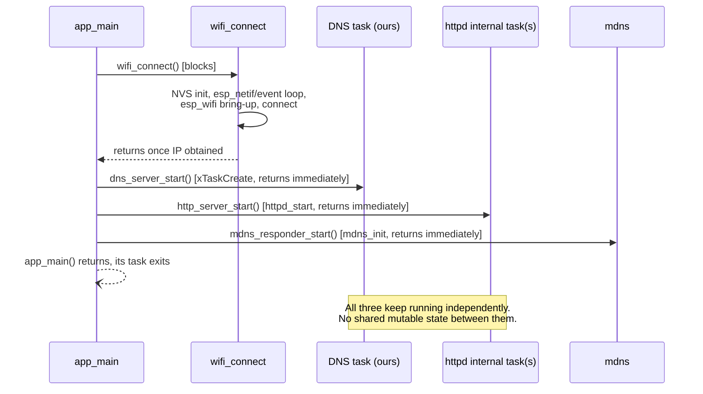

# mini_dns — Architecture

## What this is

`mini_dns` is ESP32-S3 firmware moving from proof-of-concept toward a marketable "edge DNS" appliance: a single device that connects to Wi-Fi, serves a runtime-managed set of hostnames authoritatively, forwards everything else to an upstream recursive resolver with TTL caching, sinkholes ad/tracker domains, exposes Prometheus metrics, advertises itself via mDNS, and serves an HTTP page + a JSON CRUD API for managing that record table. It was built incrementally — Wi-Fi → raw UDP → DNS parsing → single-record response → multi-record + NXDOMAIN → HTTP server → JSON API → page wired to the API → **forwarding resolver + cache (Phase 1)** → **NVS-backed ad-block (Phase 2)** → **Prometheus `/metrics` (Phase 3)** → **mDNS responder (Phase 4)** → **record management: persistence + CRUD API + auth (Phase 5)** — each step flashed and confirmed on real hardware before moving on.

**As of Phase 5, records are runtime-managed** — persisted in NVS, editable via `POST`/`PUT`/`DELETE /api/records` (Basic-auth-gated), no longer a reflash-only compile-time table. There is still no provisioning UI, no OTA, no TLS. If you're extending this, read the Non-Goals section before adding anything that smells like a "real" feature.

## Target hardware / toolchain

- ESP32-S3, built with ESP-IDF v5.4 (C++17/`gnu++2b`, exceptions and RTTI disabled — see Gotchas).
- Not a git repository as of this writing — no commit history to cross-reference.

## Boot sequence & concurrency model



Four independent runtime pieces exist after boot, with **no synchronization between them**:

1. **Wi-Fi event handling** (`wifi_connect.cpp`) — registered event handlers keep running for the life of the device (auto-reconnect on disconnect, plus IPv6 link-local bring-up as of Phase 4), but `wifi_connect()` itself only blocks `app_main` during initial IPv4 bring-up.
2. **DNS task** (`dns_server.cpp`) — a task we create explicitly via `xTaskCreate`, because raw BSD sockets have no framework driving an accept/receive loop for us.
3. **HTTP server task(s)** (`http_server.cpp`) — `esp_http_server` owns and drives its own task(s) internally; we only configure and start it.
4. **mDNS responder task** (`mdns_responder.cpp`, Phase 4) — the `mdns` component owns and drives its own internal task, the same shape as `esp_http_server`; we only configure and start it. It reads whatever A/AAAA addresses the STA netif currently holds and shares no mutable state with the other three pieces.

**As of the forwarding resolver (Phase 1), the DNS task also owns a cache and an in-flight query table** (`DnsCache`, `DnsForwarder`) — these *are* mutable, but they're only ever touched from within the single DNS task's `select()` loop, so the "no shared mutable state across tasks" property still holds; it's just no longer literally "no mutable state," only "no mutable state shared *between* tasks."

Three pieces of state cross the DNS task / HTTP task boundary. Two do it without a mutex: `DnsBlocklist`'s domain set (Phase 2) is populated once at boot and never mutated again, so concurrent reads need no synchronization; and `DnsMetrics` (Phase 3) is a set of `std::atomic<uint32_t>` counters/gauges — the DNS task increments/sets them inline, the HTTP task's `/metrics` handler reads a `snapshot()`. Both were narrow, deliberate exceptions to "no shared mutable state," justified the same way: either the shared value is immutable after boot, or it's a single atomic word.

**`DnsRecordStore` (Phase 5) breaks that pattern on purpose — it's the first genuinely shared *mutable* state, guarded by a real `std::mutex`.** The record table can be neither immutable-after-boot (records are edited at runtime by design) nor a bag of atomics (a record is a hostname+IP pair that must be read as one consistent unit, not field-by-field). The DNS task's `record_store().find()` locks briefly per query; the HTTP task's `create()`/`update()`/`remove()` lock to mutate and persist. This is a deliberate, documented departure from the "lock-free DNS path" property every earlier phase preserved — see the Phase 5 design doc for why a plain mutex was chosen over a lock-free (atomic-snapshot) alternative, and for why `find()` returns a *copy* of the IP rather than a pointer/reference into the table.

## Component map

| File | Responsibility |
|---|---|
| `main/main.cpp` | Boot sequence: logs detected PSRAM size → `wifi_connect()` → `dns_server_start()` → `http_server_start()` → `mdns_responder_start()`. |
| `main/wifi_connect.h/.cpp` | Blocking Wi-Fi station bring-up with hardcoded credentials. Retries forever on disconnect (2s backoff), no give-up state. As of Phase 4, also triggers IPv6 link-local address creation on `WIFI_EVENT_STA_CONNECTED` (non-blocking, doesn't gate boot readiness) so mDNS has an address to advertise as AAAA. |
| `main/wifi_credentials.h` | `WIFI_SSID`/`WIFI_PASSWORD` constants. **Gitignored** — does not exist on a fresh checkout, must be recreated. |
| `main/admin_credentials.h` | `ADMIN_USER`/`ADMIN_PASS` constants for Basic auth on the mutating `/api/records` routes (Phase 5). **Gitignored**, same pattern as `wifi_credentials.h` — does not exist on a fresh checkout, must be recreated. |
| `main/dns_records.h` | The seed hostname→IPv4 table (`DNS_RECORDS_DEFAULTS`, a `constexpr std::array<dns_record_t, N>`), consulted only once by `DnsRecordStore::load_from_nvs()` on first boot (Phase 5) — the live table lives in NVS afterward. Pure data, no logic, no dependencies beyond `<array>`/`<cstdint>`. |
| `main/dns_record_store.h/.cpp` | Runtime-managed DNS record table (`DnsRecordStore`, Phase 5) — NVS-persisted, guarded by a `std::mutex` since it's the first cross-task state that's genuinely shared *and* mutable. DNS task calls `find()` (returns a copy, not a pointer); HTTP task calls `snapshot()`/`create()`/`update()`/`remove()`. |
| `main/dns_wire.h/.cpp` | Pure DNS wire-format functions: header/question parsing, name skipping, answer-section TTL scanning, and response building (A-record, NXDOMAIN, and a generic "relay a captured answer section" builder used by both cache hits and forwarded replies). No I/O, no FreeRTOS/lwIP dependency — the natural home for host-side unit tests. |
| `main/dns_cache.h/.cpp` | TTL cache (`DnsCache`) keyed by (lowercased qname, qtype), storing captured answer-section bytes + a clamped TTL. Single-owner (the DNS task); no mutex. |
| `main/dns_forwarder.h/.cpp` | Upstream UDP client socket (`DnsForwarder`) plus the in-flight query table that correlates upstream replies back to the client that asked, using a slot-index + generation-counter transaction ID scheme. Single-owner; no mutex. |
| `main/dns_server.h/.cpp` | UDP/53 listener in its own FreeRTOS task, running a `select()` loop over the listen socket and the forwarder's upstream socket. Resolves each query via record store → blocklist → cache → forward, in that order, and reaps timed-out forwarded queries into SERVFAIL. Also the sole writer of `DnsMetrics` (Phase 3). |
| `main/dns_blocklist.h/.cpp` | NVS-backed ad-block domain set (`DnsBlocklist`), suffix-matched on label boundaries. Populated once at boot, never mutated afterward — safely read from both the DNS and HTTP tasks with no lock; only its atomic block counter changes at runtime. |
| `main/dns_metrics.h/.cpp` | Runtime counters/gauges/histogram for `/metrics` (`DnsMetrics`, Phase 3) — query/cache/forward/SERVFAIL counts, an upstream-latency histogram, and cache/in-flight occupancy gauges. Written only by the DNS task, read only by the HTTP task's `/metrics` handler, all via `std::atomic<uint32_t>` — the same cross-task shape as `DnsBlocklist`'s counter, generalized into its own module. |
| `main/http_server.h/.cpp` | `esp_http_server` bring-up with routes: `GET /` (static HTML page with an inline `fetch()` script), `GET`/`POST`/`PUT`/`DELETE`/`OPTIONS /api/records` (JSON CRUD via cJSON, mutating routes Basic-auth-gated and CORS-enabled — Phase 5), `GET /api/blocklist` (Phase 2), and `GET /metrics` (Prometheus plaintext, Phase 3). |
| `main/mdns_responder.h/.cpp` | mDNS responder bring-up (Phase 4, `espressif/mdns` managed component) — advertises the device as `edge-dns.local` (A + AAAA) plus an `_http._tcp` service pointing at the dashboard. Owns its own internal task, no shared mutable state with the DNS/HTTP tasks. |

## Data flow

**DNS query** (`dns_server.cpp`, `select()` loop in `dns_server_task`, blocking on both the listen socket and the forwarder's upstream socket):

```
select() wakes on listen socket readable
  → recvfrom() → parse_dns_header() → parse_question_name() → read qtype/qclass
  → record_store().find()  (locked, case-insensitive scan of the record table)
      match, qtype==A  → build_a_record_response()                    → sendto()
      match, other type→ build_nxdomain_response()  (existing simplification, see Gotchas)
      no match         → DnsCache::lookup(lowercased qname, qtype)
                             hit  → build_relayed_response(cached answer) → sendto()
                             miss → DnsForwarder::forward()
                                      (allocates in-flight slot, sends upstream;
                                       response comes later, below — or SERVFAIL
                                       immediately if the table's full/send failed)

select() wakes on forwarder socket readable
  → DnsForwarder::handle_upstream_readable()
      (matches reply to its in-flight slot via slot-index + generation in the
       transaction ID, scans the answer section for min TTL)
  → DnsCache::insert()               (caches the answer, or a capped-TTL
                                       negative entry if ancount == 0)
  → build_relayed_response()  → sendto() to the original client

select() times out, or every loop iteration regardless of wake reason
  → DnsForwarder::reap_expired()     (in-flight queries past their deadline)
  → build_relayed_response(SERVFAIL) → sendto() to each one's client
  → (on a bare timeout) DnsCache::sweep_expired()
```

Local-table responses still echo the request's question section verbatim and reuse a compression pointer (`0xC00C`) back to it rather than re-encoding the name — the question always starts at byte offset 12, right after the fixed-size header, so that pointer value is always correct. Cache-hit and forwarded responses do the same, via `build_relayed_response()`, which additionally splices in a previously-captured answer section; that's wire-format-safe specifically because the captured section is always replayed at the same absolute byte offset it was captured at (`DNS_HEADER_SIZE + question_section_len` — invariant because DNS label encoding is length-invariant across queries that differ only in ASCII case). See the Phase 1 design doc for the full argument.

**Upstream transaction ID scheme** (`dns_forwarder.cpp`): the in-flight table has a fixed power-of-two size (32). Each outstanding query is assigned an upstream-facing transaction ID whose low bits are the table slot index and whose high bits are a per-slot generation counter, incremented every time the slot is reused. This gives O(1) matching of an upstream reply to its slot (no linear scan), and the generation counter is what safely rejects a stale reply for an already-expired-and-reused slot instead of misrouting it to the wrong client.

**HTTP request** (`http_server.cpp`):
- `GET /` → static HTML shell with an inline `<script>` that does `fetch('/api/records')` and renders the result as a table (`textContent`, not `innerHTML`). Unmodified by Phase 5 — kept as a built-in fallback; the record-management UI is a separate project built against the API below.
- `GET /api/records` → builds a `cJSON` array from `record_store().snapshot()` (a locked copy — Phase 5), serializes with `cJSON_PrintUnformatted`, sends as `application/json`. Unauthenticated, like every other GET.
- `POST`/`PUT`/`DELETE /api/records` (Phase 5) → `add_cors_headers()` (reflects `Origin`) → `check_auth()` (Basic auth against `admin_credentials.h`; 401 + `WWW-Authenticate` on failure) → parses/validates a `{"host","ip"}` JSON body → `record_store().create()`/`update()`/`remove()`, mapped to `201`/`200`/`404`/`409`/`507`. `OPTIONS /api/records` answers CORS preflight (204, no auth). See the Phase 5 design doc for the full validation/status-code mapping.
- `GET /api/blocklist` → cJSON object with the blocklist's size, running block count, and domain list (Phase 2).
- `GET /metrics` (Phase 3) → `metrics().snapshot()` plus `blocklist().blocks_total()`/`size()`, rendered as Prometheus plaintext (`text/plain; version=0.0.4`): counters, an upstream-latency histogram, and cache/in-flight gauges. See the Phase 3 design doc for the full series list and why a histogram was chosen over a bare sum+count.

**mDNS discovery** (`mdns_responder.cpp`, Phase 4) — a parallel path to the HTTP request flow above, not part of it: a LAN client sends a multicast query for `edge-dns.local` or browses `_http._tcp`; the `mdns` component's internal task answers directly (A/AAAA for the hostname, PTR/SRV/TXT for the service), independent of both the DNS task's unicast UDP/53 listener and the HTTP task. Resolving the name is a separate step from then fetching it — `curl http://edge-dns.local/` still ends up going through the ordinary HTTP request flow once resolved.

## Design decisions & gotchas worth remembering

These are the things most likely to confuse future-you or bite an extension:

- **`RX_BUFFER_SIZE = 512`** (`dns_server.cpp`) — the classic DNS-over-UDP cap without EDNS0. A larger/malformed packet silently truncates on `recvfrom` (no `MSG_TRUNC` handling); acceptable today since there's no parser path that needs to detect truncation, but the first thing to revisit if you ever see mysteriously-wrong parses for large queries.
- **`CONFIG_HTTPD_MAX_REQ_HDR_LEN=1024`** (`sdkconfig.defaults`) — bumped up from ESP-IDF's default of 512. Real browsers (Chrome/Safari, with `Sec-Fetch-*`/`sec-ch-ua*`/cookies/etc.) send header blocks that exceed 512 bytes total and get rejected with HTTP 431 ("Header fields are too long"); `curl`'s minimal headers never hit this, which is why it can look fine under `curl` and still break in a real browser.
- **No longer a leaf resolver, but still not true recursion** — anything not in `DNS_RECORDS` is now forwarded to an upstream recursive resolver (`DNS_FORWARDER_UPSTREAM_IP`, currently 1.1.1.1) and cached, rather than immediately NXDOMAIN'd. This is deliberately *forwarding*, not iterative resolution from the root servers — see the Phase 1 design doc for why true recursion was rejected as disproportionate for an MCU-class device. A single upstream with no failover is a v1 simplification: if it's unreachable, every non-local query times out to SERVFAIL after `DNS_FORWARDER_TIMEOUT_MS` (2s) rather than falling back to a secondary.
- **PSRAM mode is a module-specific assumption** — `sdkconfig.defaults` assumes octal PSRAM (the common WROOM-1 N16R8 pairing with this build's 16MB flash). `CONFIG_SPIRAM_IGNORE_NOTFOUND` keeps boot from hard-failing if that's wrong, and `main.cpp` logs detected PSRAM size at boot so a mismatch is visible immediately rather than showing up later as an unexplained cache-capacity shortfall.
- **Cache and in-flight table are mutable state, but still single-owner** — both live entirely inside the DNS task's `select()` loop (`dns_server.cpp`), so the codebase's original "no mutex needed" property is preserved; it's just no longer true that *nothing* is mutable, only that nothing mutable crosses a task boundary.
- **`CONFIG_LWIP_MAX_SOCKETS` is a shared budget across the whole IP stack, and `esp_http_server` checks against it at `httpd_start()`** — its default `max_open_sockets` (7) plus 3 reserved internally is an *exact* fit against ESP-IDF's own default (10), leaving zero headroom. Phase 1 added two sockets outside httpd (DNS listen, forwarder upstream) without raising this, which first shipped as `CONFIG_LWIP_MAX_SOCKETS=8` — actually *lower* than the default — causing `httpd_start()` to abort with `ESP_ERR_INVALID_ARG` on every boot (a crash-reboot loop, not a Wi-Fi problem, even though it happens right after "connected, IP: ..." in the log). Any future socket added outside httpd needs this budget re-checked, not just incremented by one.
- **`.local` and mDNS — two different things now.** `DNS_RECORDS` was moved off `.local` onto `.loc` (see the `laptop.loc` entry) specifically because RFC 6762 reserves `.local` for multicast DNS: client OS resolvers (especially Apple's) intercept `.local` queries and route them to mDNS instead of whatever unicast DNS server is configured, so a phone/laptop browser would **never** actually ask this device about a `.local` name even with its DNS correctly pointed here. Phase 4 then added a *real* mDNS responder — but only for the device's own name (`edge-dns.local`), not for `DNS_RECORDS`. So: `test.loc`/`router.loc`/etc. are answered by the unicast resolver only (still needs DNS correctly pointed here, or `dig`/`nslookup` to bypass OS special-casing); `edge-dns.local` is answered by mDNS only (any client on the LAN, no DNS configuration needed). Delegating `DNS_RECORDS` as mDNS-resolvable `.local` hosts too was considered and deferred — see the Phase 4 design doc's Open threads.
- **Startup calls use `ESP_ERROR_CHECK`; per-packet/per-request calls use errno + log + continue.** `esp_wifi_*`, `httpd_start`, `httpd_register_uri_handler` are one-shot, `esp_err_t`-returning, startup-time calls — if they fail, there's no meaningful degraded mode, so they panic immediately with a clear file/line. `socket()`/`bind()`/`recvfrom()`/`sendto()` are raw BSD calls returning `-1`/`errno`, called continuously in a loop — a single bad packet or transient send failure is logged and the loop continues, since aborting the whole device over one dropped packet would be wrong. Keep this split when adding new calls rather than picking one style for the whole codebase.
- **Case-insensitive hostname matching** — DNS names are case-insensitive per RFC 1035 §2.3.3; as of Phase 5 this lives in `DnsRecordStore::find_index_locked()` (`dns_record_store.cpp`), having moved out of `dns_server.cpp`'s now-removed `find_dns_record`/`ascii_case_insensitive_equal` when the record table became a runtime store.
- **NXDOMAIN, not NODATA, for a wrong-qtype match** — querying `AAAA` for `test.local` (which only has an A record) returns NXDOMAIN, not the RFC-correct NODATA (NOERROR + empty answers). A deliberate simplification: implementing real NODATA would require tracking "name exists at all" as a concept separate from "has an A record," for a distinction nothing in this project depends on.
- **`dns_records.h` stays pure data on purpose** — no lookup function lives there, and as of Phase 5 it's consulted only once (first-boot seeding by `DnsRecordStore::load_from_nvs()`), not on every query. The live lookup lives in `dns_record_store.cpp` next to the rest of the record-store logic.
- **`wifi_credentials.h` and `admin_credentials.h` are both gitignored** — the former holds real Wi-Fi credentials, the latter (Phase 5) the Basic-auth admin credential for the mutating `/api/records` routes. Neither exists on a fresh clone; both must be recreated by hand (see `main/CMakeLists.txt` for the exact symbols each must define).
- **Basic auth over plaintext HTTP** (Phase 5) — there's no TLS on this device, so the base64-encoded `Authorization` header is visible to anything that can see LAN traffic. Acceptable under the appliance's existing LAN-trust posture (nothing else is encrypted either), but a real security boundary needs HTTPS, which remains out of scope.
- **`httpd_resp_set_hdr()` stores a pointer, not a copy of the value string** — it must stay valid until `httpd_resp_send()` is called (per its own doc comment), not just until the function that set it returns. Bit `add_cors_headers()` (Phase 5) during hardware bring-up: its `Origin` buffer was originally a local inside that helper, called before `httpd_resp_send()` in each handler, so it went out of scope before the response was actually serialized — observed as an empty `Access-Control-Allow-Origin` value, not a crash. Fixed by moving the buffer into each handler's own frame and threading it in as an out-parameter. Re-read this rule before adding any new *dynamic* (non-string-literal) response header anywhere.
- **CORS reflects any `Origin` — effectively open** (Phase 5) — a wildcard `Access-Control-Allow-Origin: *` is disallowed by browsers alongside credentialed requests, so `add_cors_headers()` reflects whatever `Origin` the request sent instead. This means origin provides no protection by itself; `check_auth()` is the only real gate on the mutating routes.
- **`httpd_config_t::max_uri_handlers` is a small, easy-to-undercount budget** (Phase 5) — the same shape as the `CONFIG_LWIP_MAX_SOCKETS` trap below. The default (8) was an exact fit for the 4 original GET-only routes; Phase 5's 4 new `/api/records` methods (`POST`/`PUT`/`DELETE`/`OPTIONS`) made it an exact fit again, so it was bumped to 12 for headroom. The next endpoint added anywhere needs this re-checked, not just incremented by one.
- **Metrics counters are `uint32_t`, not `uint64_t`, on purpose** (Phase 3) — the Xtensa LX7 has no native 64-bit atomic instructions, so `std::atomic<uint64_t>` here would silently fall back to libatomic's lock-based implementation, reintroducing a lock into an otherwise deliberately lock-free cross-task read path. A 32-bit counter wrapping after ~4B events is fine for a LAN-scale device scraped by Prometheus, which already tolerates counter resets via `rate()`.
- **No automated tests.** All verification so far has been manual and hardware-in-the-loop (flash, `dig`/`curl`/browser, read serial log). This is fine for a POC built step-by-step with a human in the loop, but it's a real gap if this code grows — the wire-format parse/build functions in `dns_wire.cpp` (`parse_dns_header`, `parse_question_name`, `skip_name`, `scan_answer_section`, the response builders) are pure functions over byte buffers, decoupled from FreeRTOS/lwIP since the Phase 1 module split, and are the most natural candidates for host-side unit tests (ESP-IDF bundles the Unity test framework) — see Phase 6 in Future scoping.

## Explicit non-goals (as scoped)

These were ruled out deliberately, not overlooked — don't reintroduce them without reopening the scoping conversation:

- Wi-Fi provisioning UI / captive portal
- OTA updates
- TLS/HTTPS — Basic auth (Phase 5) runs over plaintext HTTP; see the gotcha above
- NVS-stored/rotatable admin credentials, rate limiting on auth failures — see the Phase 5 design doc's Open threads
- True iterative/recursive DNS resolution (root-server walking) — forwarding + caching was built instead (Phase 1); see the design doc for the rationale
- OTLP push export — rejected in favor of the pull-model `/metrics` endpoint (Phase 3); see Future scoping
- mDNS delegation of `DNS_RECORDS_DEFAULTS` as `.local` hosts — the responder built in Phase 4 advertises the device itself only, not the record table; see the Phase 4 design doc's Open threads
- A bundled record-management frontend — Phase 5 ships the JSON CRUD API only; the UI is a separate project built against it
- Heavy C++ (coroutines, modules, template metaprogramming)

## Future scoping

Roughly ordered by how naturally each extends the current design, not by priority. The overall vision is a marketable "edge DNS" appliance with configurable ad-block, metrics, mDNS, and record management; forwarding + caching, ad-block, metrics, mDNS, and record management shipped as **Phases 1–5** — see `docs/superpowers/specs/`. Phases 6–7 below are grouped by what's load-bearing for what, not by how naturally each individual item extends the current design — see each phase's rationale for why its pieces are bundled rather than split further.

1. ~~**Upstream DNS forwarding for unmatched queries.**~~ **Done (Phase 1).** See the Data flow and Gotchas sections above and the design doc.
2. ~~**Ad-block.**~~ **Done (Phase 2).** NVS-backed blocklist, suffix-matched on label boundaries, consulted before the cache/forwarder. See `docs/superpowers/specs/2026-07-21-edge-dns-phase2-adblock-design.md`.
3. ~~**Metrics endpoint.**~~ **Done (Phase 3).** `GET /metrics` in Prometheus plaintext format — query/cache/forward/SERVFAIL counters, an upstream-latency histogram, ad-block total, cache/in-flight gauges. Pull model chosen over an OTLP push client for lighter device footprint. See `docs/superpowers/specs/2026-07-21-edge-dns-phase3-metrics-design.md`.
4. ~~**mDNS responder.**~~ **Done (Phase 4).** Device self-advertisement as `edge-dns.local` (A + AAAA) plus an `_http._tcp` service via ESP-IDF's `mdns` managed component — a genuinely different mechanism from the unicast resolver, running alongside it rather than replacing it. Does not delegate `DNS_RECORDS` as `.local` hosts (see the `.local` gotcha above and the design doc's Open threads). See `docs/superpowers/specs/2026-07-21-edge-dns-phase4-mdns-design.md`.
5. ~~**Record management: NVS-backed persistence + a real add/edit/delete API + basic auth.**~~ **Done (Phase 5).** Scoped as one phase, not three, because the pieces are load-bearing for each other: `POST`/`PUT`/`DELETE` on `/api/records` is worthless without persistence behind it, and shipping either without auth would leave a mutating, unauthenticated endpoint exposed on the LAN — so none of the three shipped without the other two. Also the single biggest architectural jump so far: `DnsRecordStore` is the first cross-task state that's genuinely shared *and* mutable, guarded by a `std::mutex` — every prior phase (blocklist, metrics) avoided this by keeping cross-task state either immutable-after-boot or a single atomic word. Ships a JSON CRUD API only, no bundled frontend — the record-management UI is a separate project. See the concurrency-model section above and `docs/superpowers/specs/2026-07-21-edge-dns-phase5-record-management-design.md`.
6. **Hardening & reliability (Phase 6): AAAA record support for local-table names + host-side unit tests for the wire-format functions + a secondary/failover upstream resolver.** Bundled because none of the three touch the concurrency model or add new attack surface — unlike Phase 5, this phase rounds out correctness and resilience of what Phases 1–4 already shipped, rather than adding a new capability surface. `qtype_to_string` already recognizes AAAA numerically; actually answering AAAA queries for local-table names needs IPv6 address storage in `dns_record_t` and a second response-builder path (forwarded/cached AAAA queries for *non*-local names already work as of Phase 1 — the forwarder and cache are qtype-agnostic). The pure functions in `dns_wire.cpp` (`parse_dns_header`, `parse_question_name`, `skip_name`, `scan_answer_section`, the response builders) were decoupled from FreeRTOS/lwIP by the Phase 1 module split and are the natural first candidates for ESP-IDF's bundled Unity test framework. A second upstream tried on timeout would improve resilience without much added complexity, since Phase 1 hardcodes a single upstream with no failover.
7. **Leaving the dev bench (Phase 7): Wi-Fi provisioning (BLE/captive portal) + OTA updates.** Both explicit non-goals today. Sized as its own phase rather than folded into Phase 5 or 6 — this is the step that turns the device from "flash it from a laptop on the desk" into something that could plausibly leave the bench, and it doesn't share a dependency with either of the other two phases.

Lower-value, opportunistic — worth doing if a specific need arises, not currently phase-scoped:
- **Multiple questions per query (`qdcount > 1`)** — currently only the first question is parsed; real resolvers essentially never send more than one.
- **DNS compression pointer support in incoming client queries** — currently rejected outright in the question section (see `parse_question_name`); would only matter for unusual non-`dig`/`nslookup` clients. (Compression pointers *within* upstream answer sections are already handled — see `skip_name`/`scan_answer_section`.)
- **Per-RR TTL decrement on cache hits** — Phase 1's cache re-serves the original TTL each hit, bounded only by whole-entry expiry; decrementing per-hit would be more RFC-correct but was deferred as unnecessary complexity for v1.
