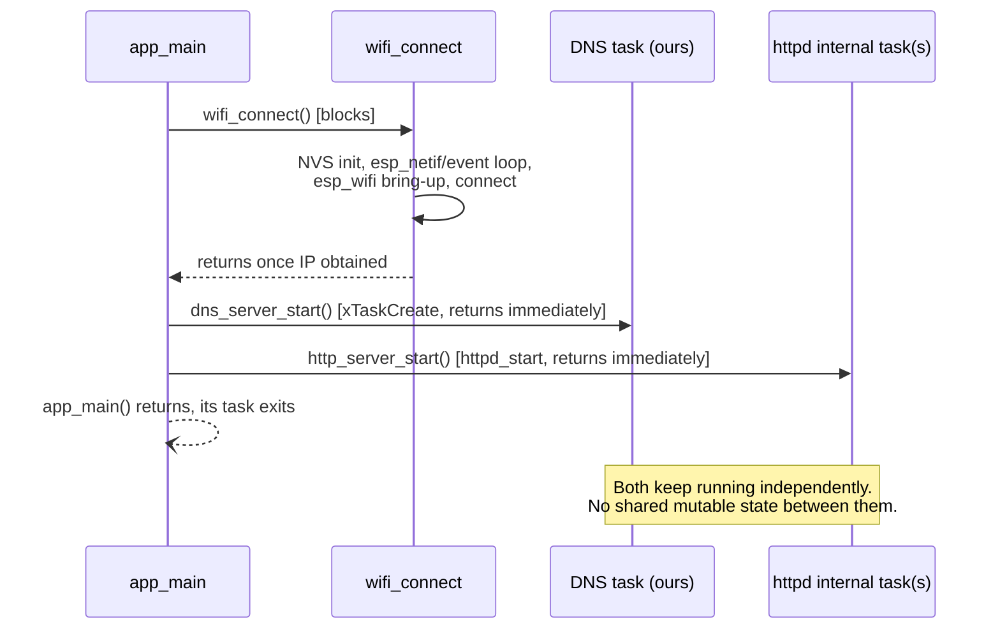

# mini_dns — Architecture

## What this is

`mini_dns` is ESP32-S3 firmware moving from proof-of-concept toward a marketable "edge DNS" appliance: a single device that connects to Wi-Fi, serves a small hardcoded set of hostnames authoritatively, forwards everything else to an upstream recursive resolver with TTL caching, and serves an HTTP page + JSON API showing the static record table. It was built incrementally — Wi-Fi → raw UDP → DNS parsing → single-record response → multi-record + NXDOMAIN → HTTP server → JSON API → page wired to the API → **forwarding resolver + cache (Phase 1 of the edge-DNS roadmap)** — each step flashed and confirmed on real hardware before moving on.

**Records are still compile-time constants, read-only after boot** — there is no persistence, no provisioning UI, no OTA, no runtime record editing, no auth. Ad-block, metrics/OTEL export, and mDNS are planned as later phases (see Future scoping), not built yet. If you're extending this, read the Non-Goals section before adding anything that smells like a "real" feature.

## Target hardware / toolchain

- ESP32-S3, built with ESP-IDF v5.4 (C++17/`gnu++2b`, exceptions and RTTI disabled — see Gotchas).
- Not a git repository as of this writing — no commit history to cross-reference.

## Boot sequence & concurrency model



Three independent runtime pieces exist after boot, with **no synchronization between them**:

1. **Wi-Fi event handling** (`wifi_connect.cpp`) — registered event handlers keep running for the life of the device (auto-reconnect on disconnect), but `wifi_connect()` itself only blocks `app_main` during initial bring-up.
2. **DNS task** (`dns_server.cpp`) — a task we create explicitly via `xTaskCreate`, because raw BSD sockets have no framework driving an accept/receive loop for us.
3. **HTTP server task(s)** (`http_server.cpp`) — `esp_http_server` owns and drives its own task(s) internally; we only configure and start it.

`DNS_RECORDS` is still `constexpr`, shared read-only across tasks with no locking needed. **As of the forwarding resolver (Phase 1), the DNS task also owns a cache and an in-flight query table** (`DnsCache`, `DnsForwarder`) — these *are* mutable, but they're only ever touched from within the single DNS task's `select()` loop, so the "no shared mutable state across tasks" property still holds; it's just no longer literally "no mutable state," only "no mutable state shared *between* tasks."

## Component map

| File | Responsibility |
|---|---|
| `main/main.cpp` | Boot sequence: logs detected PSRAM size → `wifi_connect()` → `dns_server_start()` → `http_server_start()`. |
| `main/wifi_connect.h/.cpp` | Blocking Wi-Fi station bring-up with hardcoded credentials. Retries forever on disconnect (2s backoff), no give-up state. |
| `main/wifi_credentials.h` | `WIFI_SSID`/`WIFI_PASSWORD` constants. **Gitignored** — does not exist on a fresh checkout, must be recreated. |
| `main/dns_records.h` | The hardcoded hostname→IPv4 table (`DNS_RECORDS`, a `constexpr std::array<dns_record_t, N>`). Pure data, no logic, no dependencies beyond `<array>`/`<cstdint>` — intentionally kept dependency-free. |
| `main/dns_wire.h/.cpp` | Pure DNS wire-format functions: header/question parsing, name skipping, answer-section TTL scanning, and response building (A-record, NXDOMAIN, and a generic "relay a captured answer section" builder used by both cache hits and forwarded replies). No I/O, no FreeRTOS/lwIP dependency — the natural home for host-side unit tests. |
| `main/dns_cache.h/.cpp` | TTL cache (`DnsCache`) keyed by (lowercased qname, qtype), storing captured answer-section bytes + a clamped TTL. Single-owner (the DNS task); no mutex. |
| `main/dns_forwarder.h/.cpp` | Upstream UDP client socket (`DnsForwarder`) plus the in-flight query table that correlates upstream replies back to the client that asked, using a slot-index + generation-counter transaction ID scheme. Single-owner; no mutex. |
| `main/dns_server.h/.cpp` | UDP/53 listener in its own FreeRTOS task, running a `select()` loop over the listen socket and the forwarder's upstream socket. Resolves each query via local table → cache → forward, in that order, and reaps timed-out forwarded queries into SERVFAIL. |
| `main/http_server.h/.cpp` | `esp_http_server` bring-up with two routes: `GET /` (static HTML page with an inline `fetch()` script) and `GET /api/records` (JSON array via cJSON). Unchanged by Phase 1 — still only reflects the static table, not cache/forwarding activity. |

## Data flow

**DNS query** (`dns_server.cpp`, `select()` loop in `dns_server_task`, blocking on both the listen socket and the forwarder's upstream socket):

```
select() wakes on listen socket readable
  → recvfrom() → parse_dns_header() → parse_question_name() → read qtype/qclass
  → find_dns_record()  (case-insensitive linear scan of DNS_RECORDS)
      match, qtype==A  → build_a_record_response()                    → sendto()
      match, other type→ build_nxdomain_response()  (existing simplification, see Gotchas)
      no match         → DnsCache::lookup(lowercased qname, qtype)
                             hit  → build_relayed_response(cached answer) → sendto()
                             miss → DnsForwarder::forward()
                                      (allocates in-flight slot, sends upstream;
                                       response comes later, below — or SERVFAIL
                                       immediately if the table's full/send failed)

select() wakes on forwarder socket readable
  → DnsForwarder::handle_upstream_readable()
      (matches reply to its in-flight slot via slot-index + generation in the
       transaction ID, scans the answer section for min TTL)
  → DnsCache::insert()               (caches the answer, or a capped-TTL
                                       negative entry if ancount == 0)
  → build_relayed_response()  → sendto() to the original client

select() times out, or every loop iteration regardless of wake reason
  → DnsForwarder::reap_expired()     (in-flight queries past their deadline)
  → build_relayed_response(SERVFAIL) → sendto() to each one's client
  → (on a bare timeout) DnsCache::sweep_expired()
```

Local-table responses still echo the request's question section verbatim and reuse a compression pointer (`0xC00C`) back to it rather than re-encoding the name — the question always starts at byte offset 12, right after the fixed-size header, so that pointer value is always correct. Cache-hit and forwarded responses do the same, via `build_relayed_response()`, which additionally splices in a previously-captured answer section; that's wire-format-safe specifically because the captured section is always replayed at the same absolute byte offset it was captured at (`DNS_HEADER_SIZE + question_section_len` — invariant because DNS label encoding is length-invariant across queries that differ only in ASCII case). See the Phase 1 design doc for the full argument.

**Upstream transaction ID scheme** (`dns_forwarder.cpp`): the in-flight table has a fixed power-of-two size (32). Each outstanding query is assigned an upstream-facing transaction ID whose low bits are the table slot index and whose high bits are a per-slot generation counter, incremented every time the slot is reused. This gives O(1) matching of an upstream reply to its slot (no linear scan), and the generation counter is what safely rejects a stale reply for an already-expired-and-reused slot instead of misrouting it to the wrong client.

**HTTP request** (`http_server.cpp`):
- `GET /` → static HTML shell with an inline `<script>` that does `fetch('/api/records')` and renders the result as a table (`textContent`, not `innerHTML`).
- `GET /api/records` → builds a `cJSON` array from `DNS_RECORDS`, serializes with `cJSON_PrintUnformatted`, sends as `application/json`.

## Design decisions & gotchas worth remembering

These are the things most likely to confuse future-you or bite an extension:

- **`RX_BUFFER_SIZE = 512`** (`dns_server.cpp`) — the classic DNS-over-UDP cap without EDNS0. A larger/malformed packet silently truncates on `recvfrom` (no `MSG_TRUNC` handling); acceptable today since there's no parser path that needs to detect truncation, but the first thing to revisit if you ever see mysteriously-wrong parses for large queries.
- **`CONFIG_HTTPD_MAX_REQ_HDR_LEN=1024`** (`sdkconfig.defaults`) — bumped up from ESP-IDF's default of 512. Real browsers (Chrome/Safari, with `Sec-Fetch-*`/`sec-ch-ua*`/cookies/etc.) send header blocks that exceed 512 bytes total and get rejected with HTTP 431 ("Header fields are too long"); `curl`'s minimal headers never hit this, which is why it can look fine under `curl` and still break in a real browser.
- **No longer a leaf resolver, but still not true recursion** — anything not in `DNS_RECORDS` is now forwarded to an upstream recursive resolver (`DNS_FORWARDER_UPSTREAM_IP`, currently 1.1.1.1) and cached, rather than immediately NXDOMAIN'd. This is deliberately *forwarding*, not iterative resolution from the root servers — see the Phase 1 design doc for why true recursion was rejected as disproportionate for an MCU-class device. A single upstream with no failover is a v1 simplification: if it's unreachable, every non-local query times out to SERVFAIL after `DNS_FORWARDER_TIMEOUT_MS` (2s) rather than falling back to a secondary.
- **PSRAM mode is a module-specific assumption** — `sdkconfig.defaults` assumes octal PSRAM (the common WROOM-1 N16R8 pairing with this build's 16MB flash). `CONFIG_SPIRAM_IGNORE_NOTFOUND` keeps boot from hard-failing if that's wrong, and `main.cpp` logs detected PSRAM size at boot so a mismatch is visible immediately rather than showing up later as an unexplained cache-capacity shortfall.
- **Cache and in-flight table are mutable state, but still single-owner** — both live entirely inside the DNS task's `select()` loop (`dns_server.cpp`), so the codebase's original "no mutex needed" property is preserved; it's just no longer true that *nothing* is mutable, only that nothing mutable crosses a task boundary.
- **`CONFIG_LWIP_MAX_SOCKETS` is a shared budget across the whole IP stack, and `esp_http_server` checks against it at `httpd_start()`** — its default `max_open_sockets` (7) plus 3 reserved internally is an *exact* fit against ESP-IDF's own default (10), leaving zero headroom. Phase 1 added two sockets outside httpd (DNS listen, forwarder upstream) without raising this, which first shipped as `CONFIG_LWIP_MAX_SOCKETS=8` — actually *lower* than the default — causing `httpd_start()` to abort with `ESP_ERR_INVALID_ARG` on every boot (a crash-reboot loop, not a Wi-Fi problem, even though it happens right after "connected, IP: ..." in the log). Any future socket added outside httpd needs this budget re-checked, not just incremented by one.
- **`.local` hostnames and mDNS** — `DNS_RECORDS` uses `.local` names (matching the original brief's example), but RFC 6762 reserves `.local` for multicast DNS. Client OS resolvers (especially Apple's) intercept `.local` queries and route them to mDNS instead of whatever unicast DNS server is configured — meaning a phone/laptop browser will **never** actually ask this device about a `.local` name, even with its DNS correctly pointed here. Only tools that bypass the OS's special-casing (`dig`, `nslookup`) or genuinely unreserved TLDs (`.loc`, `.test` — see the `laptop.loc` entry) work reliably end-to-end from a browser. If extending the record table for real device access, prefer a non-`.local` TLD.
- **Startup calls use `ESP_ERROR_CHECK`; per-packet/per-request calls use errno + log + continue.** `esp_wifi_*`, `httpd_start`, `httpd_register_uri_handler` are one-shot, `esp_err_t`-returning, startup-time calls — if they fail, there's no meaningful degraded mode, so they panic immediately with a clear file/line. `socket()`/`bind()`/`recvfrom()`/`sendto()` are raw BSD calls returning `-1`/`errno`, called continuously in a loop — a single bad packet or transient send failure is logged and the loop continues, since aborting the whole device over one dropped packet would be wrong. Keep this split when adding new calls rather than picking one style for the whole codebase.
- **Case-insensitive hostname matching** (`ascii_case_insensitive_equal` in `dns_server.cpp`) — DNS names are case-insensitive per RFC 1035 §2.3.3; this was added deliberately at the multi-record step rather than deferred again.
- **NXDOMAIN, not NODATA, for a wrong-qtype match** — querying `AAAA` for `test.local` (which only has an A record) returns NXDOMAIN, not the RFC-correct NODATA (NOERROR + empty answers). A deliberate simplification: implementing real NODATA would require tracking "name exists at all" as a concept separate from "has an A record," for a distinction nothing in this project depends on.
- **`dns_records.h` stays pure data on purpose** — no lookup function lives there. The lookup (`find_dns_record`) lives in `dns_server.cpp` next to the rest of the DNS logic, so the records header never needs to pull in `<string>`/`<optional>` or make a case-sensitivity decision itself.
- **`wifi_credentials.h` is gitignored** — contains real Wi-Fi credentials as `constexpr const char*` values. Does not exist on a fresh clone; must be recreated by hand (see `main/CMakeLists.txt` for the exact symbols it must define: `WIFI_SSID`, `WIFI_PASSWORD`).
- **No automated tests.** All verification so far has been manual and hardware-in-the-loop (flash, `dig`/`curl`/browser, read serial log). This is fine for a POC built step-by-step with a human in the loop, but it's a real gap if this code grows — the wire-format parse/build functions in `dns_server.cpp` (`parse_dns_header`, `parse_question_name`, `build_a_record_response`, `build_nxdomain_response`) are pure functions over byte buffers and are the most natural candidates for host-side unit tests (ESP-IDF bundles the Unity test framework) if that's ever worth adding.

## Explicit non-goals (as scoped)

These were ruled out deliberately, not overlooked — don't reintroduce them without reopening the scoping conversation:

- NVS / LittleFS persistence for records
- Wi-Fi provisioning UI / captive portal
- OTA updates
- Runtime add/edit/delete of DNS records
- True iterative/recursive DNS resolution (root-server walking) — forwarding + caching was built instead (Phase 1); see the design doc for the rationale
- Authentication or access control
- Ad-block, mDNS responder, metrics/OTEL export — planned as later phases (see Future scoping), not built yet
- Heavy C++ (coroutines, modules, template metaprogramming)

## Future scoping

Roughly ordered by how naturally each extends the current design, not by priority. The overall vision is a marketable "edge DNS" appliance with configurable ad-block, metrics, and mDNS; forwarding + caching (previously listed here as item 2) shipped as **Phase 1** — see `docs/superpowers/specs/2026-07-21-edge-dns-phase1-design.md`.

1. ~~**Upstream DNS forwarding for unmatched queries.**~~ **Done (Phase 1).** See the Data flow and Gotchas sections above and the design doc.
2. **Ad-block (Phase 2).** A small curated exact-match blocklist (baked-in or NVS-backed), consulted before the cache/forwarder in the resolution order, returning NXDOMAIN or `0.0.0.0` for blocked names. Hooks directly into the resolver built in Phase 1.
3. **Metrics endpoint (Phase 3).** `GET /metrics` in Prometheus plaintext format on the existing `esp_http_server` — query count, cache hit/miss, blocks, upstream latency, in-flight table depth. Pull model chosen over an OTLP push client for lighter device footprint.
4. **mDNS responder for real `.local` support (Phase 4).** The `.local` gotcha (see above) is best solved by actually implementing multicast DNS advertisement (e.g. via ESP-IDF's `mdns` component) rather than fighting client OS behavior — a genuinely different mechanism from the unicast resolver, running alongside it rather than replacing it.
5. **NVS-backed persistence + a real add/edit/delete API.** Would need input validation (hostname syntax, IP parsing), a storage schema, and probably auth (see below) before it's safe to expose over HTTP. This is the single biggest architectural jump from the current design — `DNS_RECORDS` stops being `constexpr`, and `find_dns_record` needs a mutex or similar since it'd now cross the DNS task / HTTP task boundary as shared mutable state.
6. **`POST`/`PUT`/`DELETE` on `/api/records`**, paired with #5 — natural home for it given the JSON API already exists for reads.
7. **Basic auth** on any endpoint that becomes mutating (#5/#6) — not needed while everything is read-only, becomes necessary the moment editing exists.
8. **AAAA (IPv6) record support** — `qtype_to_string` already recognizes AAAA numerically; actually answering AAAA queries for local-table names would need IPv6 address storage in `dns_record_t` and a second response-builder path. (Forwarded/cached AAAA queries for *non*-local names already work as of Phase 1 — the forwarder and cache are qtype-agnostic.)
9. **Multiple questions per query (`qdcount > 1`)** — currently only the first question is parsed; real resolvers essentially never send more than one, so this is low-value unless a specific client needs it.
10. **DNS compression pointer support in incoming client queries** — currently rejected outright in the question section (see `parse_question_name`); would only matter for unusual non-`dig`/`nslookup` clients. (Compression pointers *within* upstream answer sections are already handled — see `skip_name`/`scan_answer_section`.)
11. **Wi-Fi provisioning** (BLE/captive portal) to replace hardcoded credentials, and **OTA updates** — both explicit non-goals today, but the natural next step if this ever needs to leave a dev bench.
12. **Host-side unit tests** for the pure functions in `dns_wire.cpp` (`parse_dns_header`, `parse_question_name`, `skip_name`, `scan_answer_section`, the response builders) — now decoupled from FreeRTOS/lwIP by the Phase 1 module split, making this cheaper to add than before.
13. **Per-RR TTL decrement on cache hits** — Phase 1's cache re-serves the original TTL each hit, bounded only by whole-entry expiry; decrementing per-hit would be more RFC-correct but was deferred as unnecessary complexity for v1.
14. **Secondary/failover upstream resolver** — Phase 1 hardcodes a single upstream; a second one tried on timeout would improve resilience without much added complexity.
