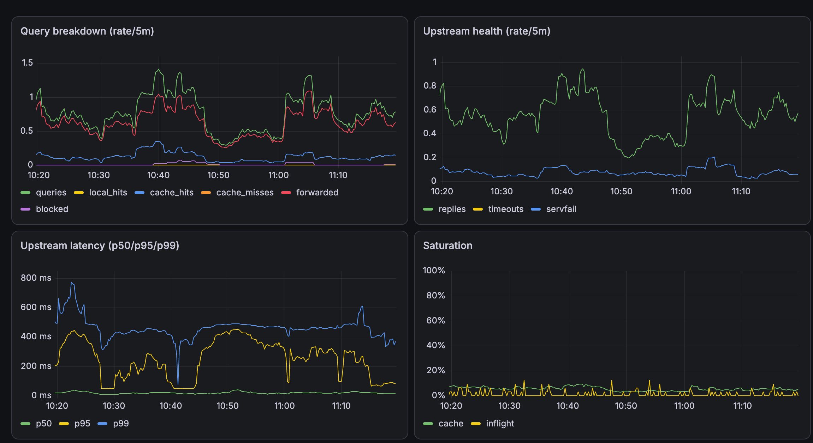

# mini_dns

A minimal ESP32-S3 firmware that connects to Wi-Fi, resolves a runtime-managed set of hostnames over DNS (UDP/53), forwards everything else to an upstream resolver with TTL caching, sinkholes ad/tracker domains, advertises itself via mDNS, and serves an HTTP page + a JSON CRUD API + Prometheus metrics.

A marketable "edge DNS" appliance — no TLS. Records are NVS-persisted and editable via a Basic-auth-gated CRUD API, dual-stack (A+AAAA), self-updating over signed OTA, and self-provisioning over a SoftAP captive portal (see below) — with a secondary-upstream retry on forward timeout and a host-side Unity test suite for the wire-format and validation layers. See [`ARCHITECTURE.md`](ARCHITECTURE.md) for design details, gotchas, and future scoping — including which phase shipped what, if you're curious about the build order.

## Prerequisites

- An ESP32-S3 dev board
- [ESP-IDF](https://docs.espressif.com/projects/esp-idf/en/stable/esp32s3/get-started/index.html) v5.4+ installed and working (this project was built/tested against v5.4.4)
- A USB cable and the board's serial port drivers, if your OS needs them

## Setup

1. **Clone the repo:**
   ```
   git clone https://github.com/RndmCodeGuy20/mini_dns.git
   cd mini_dns
   ```

2. **Create `main/wifi_credentials.h`** — gitignored, does not exist on a fresh clone, and still required for the build to compile (`wifi_connect.cpp` includes it unconditionally). The values in it only matter as a **first-boot seed**: the device persists its actual Wi-Fi config in esp_wifi's own NVS storage, so after the first successful connect this header is never consulted again. If you'd rather not put real credentials in a file at all, placeholder values are fine — the seed just won't connect, the device falls back to its SoftAP portal after 30s, and you provision it from there instead. See [Wi-Fi provisioning](#wi-fi-provisioning) below.
   ```cpp
   #pragma once
   constexpr const char* WIFI_SSID = "your-ssid";
   constexpr const char* WIFI_PASSWORD = "your-password";
   ```

3. **Create `main/admin_credentials.h`** — gitignored, same pattern as above. This is the Basic-auth credential checked on the mutating `POST`/`PUT`/`DELETE /api/records` routes:
   ```cpp
   #pragma once
   constexpr const char* ADMIN_USER = "admin";
   constexpr const char* ADMIN_PASS = "your-password";
   ```

4. **Edit `main/dns_records.h`** with your own hostname → IPv4 mappings. This is only the **first-boot seed** — `DNS_RECORDS_DEFAULTS` is loaded into NVS once, then the live table lives there and is managed via the CRUD API below, not by reflashing:
   ```cpp
   constexpr std::array<dns_record_t, N> DNS_RECORDS_DEFAULTS = {{
       {"myhost.loc", {192, 168, 1, 100}},
       // ...
   }};
   ```
   Avoid the `.local` TLD for anything you intend to reach from a phone/laptop browser — see the mDNS gotcha below. (The device itself is always reachable at `edge-dns.local` regardless of what TLD your records use.) This seed table is IPv4-only; an AAAA address for a seeded name can be added afterward through the CRUD API below once the device has booted.

## Building and flashing

```
source $IDF_PATH/export.sh   # e.g. ~/esp/esp-idf/export.sh
idf.py set-target esp32s3
idf.py build
idf.py -p <PORT> flash monitor
```

Finding `<PORT>`:
- macOS: `ls /dev/tty.usbserial-* /dev/tty.usbmodem*`
- Linux: usually `/dev/ttyUSB0` or `/dev/ttyACM0`

On boot you should see log lines for Wi-Fi connecting (with the assigned IP), the DNS server binding to port 53, and the HTTP server starting on port 80. If no network is reachable within 30s, the device instead logs that it's starting the provisioning portal — see below. Exit the serial monitor with `Ctrl+]`.

## Wi-Fi provisioning

If the device has no working Wi-Fi config — first boot with a bad/placeholder seed, a router that's down, or after a factory reset — it comes up as its own open access point instead of retrying forever:

1. Join **`edge-dns-setup`** from a phone or laptop (no password). Most OSes pop the captive-portal page automatically; if not, browse to any address — the device answers every DNS query with its own IP (`192.168.4.1` by default) and every HTTP path with the setup form.
2. Pick a network from the scanned list (or type an SSID manually) and enter its password, then submit.
3. The device saves the config, reboots, and joins that network in station mode as usual.

**Factory reset:** hold the board's **BOOT** button (GPIO0) for about 5 seconds. This wipes the stored Wi-Fi config and reboots straight back into the provisioning portal — the recovery path if you provisioned the wrong password and don't have a cable handy.

The provisioning portal (`/scan`, `/provision`, and the form itself) is intentionally unauthenticated: the AP is open by definition, and there's no credential yet to gate it behind — anyone close enough to join `edge-dns-setup` already has the same access a cable would give them.

## Testing

Replace `<esp32-ip>` with the IP logged on boot:

```
dig @<esp32-ip> <your-hostname>       # DNS resolution — record store, cache, or forwarded upstream
dig @<esp32-ip> doubleclick.net       # sinkholed (0.0.0.0 / NXDOMAIN) if on the ad-block list
curl http://<esp32-ip>/               # HTML dashboard
curl http://<esp32-ip>/api/records    # JSON record list
curl http://<esp32-ip>/api/blocklist  # JSON blocklist status + running block count
curl http://<esp32-ip>/metrics        # Prometheus plaintext metrics
curl http://edge-dns.local/           # same dashboard, resolved via mDNS instead of raw IP

# Record management — POST/PUT/DELETE require Basic auth
curl -u admin:<your-password> -X POST -d '{"host":"foo.loc","ip":"192.168.1.99"}' \
  http://<esp32-ip>/api/records
curl -u admin:<your-password> -X PUT -d '{"host":"foo.loc","ip":"192.168.1.100"}' \
  http://<esp32-ip>/api/records
curl -u admin:<your-password> -X DELETE -d '{"host":"foo.loc"}' \
  http://<esp32-ip>/api/records

# Dual-stack records — "ip" and "ipv6" are each optional, but a
# create/update needs at least one; either or both together are fine
curl -u admin:<your-password> -X POST \
  -d '{"host":"dual.loc","ip":"192.168.1.99","ipv6":"2001:db8::1"}' \
  http://<esp32-ip>/api/records
dig @<esp32-ip> AAAA dual.loc          # answered locally, not forwarded
dig @<esp32-ip> AAAA foo.loc           # v4-only record: NOERROR, no answer (NODATA) — not NXDOMAIN
```

## Monitoring

A Prometheus + Grafana stack for the `/metrics` endpoint lives in
[`monitoring/`](monitoring/) (docker-compose, scrape config, provisioned
Grafana dashboard) — see `monitoring/README.md` for setup.



## OTA updates

The device checks GitHub Releases for a newer tagged version every 6 hours, and can also be triggered on demand, then updates itself over HTTPS:

```
curl http://<esp32-ip>/api/ota                              # current status
curl -u admin:<your-password> -X POST http://<esp32-ip>/api/ota/check   # trigger a check now
```

A newly-flashed or newly-updated image stays in "pending_verify" until it's been up ~30s and answered at least one DNS query, or until 10 minutes have passed regardless of traffic (so an idle-but-healthy device isn't stuck forever) — only then does it cancel the bootloader's rollback, and only then will it accept another OTA check (an attempt while still pending_verify is rejected with 409, matching how `esp_ota_begin()` itself refuses to start an update on an unverified image). If it crashes before the gate passes, the bootloader reverts to the previous image on next reset.

## Reliability & crash forensics

A crash (panic or task-watchdog timeout) writes a coredump to the flash partition reserved for it, then reboots. `GET /metrics` exposes `esp_coredump_present` — a 1 there is the signal to go get a cable:

```
idf.py -p <PORT> coredump-info      # decode and symbolize the stored dump
```

`/metrics` also carries `esp_reset_reason{reason="..."}` (`poweron`, `sw`, `panic`, `task_wdt`, ...) and heap/PSRAM/uptime gauges for tracking a slow leak or fragmentation over time.

## Running host tests

The pure DNS wire-format functions (`main/dns_wire.h/.cpp`) have no FreeRTOS/lwIP
dependency, so they're covered by a Unity test suite that builds and runs on the
host — no board, no QEMU:

```
source $IDF_PATH/export.sh
idf.py --preview set-target linux -C host_test build
./host_test/build/host_test.elf
```

Exits 0 with `47 Tests 0 Failures` on success — a nonzero exit is Unity's failure
count, so this is CI-friendly as-is.

## Continuous Integration

Every push and pull request runs two independent GitHub Actions jobs
(`.github/workflows/ci.yml`): `firmware-build` (ESP32-S3 target, same `idf.py
build` as above) and `host-tests` (the `host_test/` Unity suite, same commands as
above). Both jobs run inside the `espressif/idf:release-v5.4` Docker image, so
they match the ESP-IDF version this README documents.

Pushing a version tag (`git tag v0.6.0 && git push --tags`) additionally
triggers a `release` job that builds the firmware and attaches
`bootloader.bin`/`partition-table.bin`/`mini_dns.bin` to a GitHub Release.
**These release binaries are built with placeholder Wi-Fi/admin credentials and
will not join any real network** — CI has no access to your real
`wifi_credentials.h`/`admin_credentials.h` (both gitignored, by design — see
Setup above). Anyone deploying to a real device still needs to create those two
files locally and rebuild, exactly as in Setup steps 2–3; the release binaries
exist as a CI-verified reference build, not a flash-and-go artifact.

## Known gotchas

Full reasoning for each of these lives in `ARCHITECTURE.md`'s Gotchas section — this list is just enough to know they exist:

- `.local` hostnames won't resolve from a phone/laptop browser (mDNS claims that TLD first); use `.loc`/`.test` etc. for your own records. `edge-dns.local` (the device itself) still works via the mDNS responder.
- Unmatched queries are forwarded and cached, not recursively resolved — a primary-upstream timeout gets one retry against a secondary before SERVFAIL.
- `/metrics` counters only reset on reboot; there's no zero/reset endpoint.
- Basic auth on the mutating `/api/records` routes runs over plaintext HTTP — fine on a trusted LAN, not a real security boundary. Same for CORS: it reflects whatever `Origin` a request sends, so Basic auth is the only real gate.
- The Wi-Fi provisioning portal (`/scan`, `/provision`, setup page) carries no auth — the AP being open is the access control, and it never runs concurrently with normal operation.
- A task-watchdog timeout now panics and reboots (writing a coredump) instead of only logging; only the DNS task is subscribed. There's no raw coredump download endpoint — `esp_coredump_present` in `/metrics` just tells you to go pull one with `idf.py coredump-info` over USB.
- A failed STA connect falls back to the portal without erasing stored Wi-Fi credentials — a router that's merely rebooting recovers on its own; only a factory reset or a fresh submission through the portal changes what's stored.

Two operational notes worth calling out here specifically, since they're setup steps rather than design tradeoffs:

- **OTA updates require a signing key you generate once.** `secure_boot_signing_key.pem` is gitignored like `wifi_credentials.h`; generate it with `espsecure.py generate_signing_key --version 2 --scheme ecdsa256 secure_boot_signing_key.pem` before your first build — the `--scheme ecdsa256` flag matters, since `espsecure.py` defaults to an RSA key otherwise, which this project's ECDSA-based sdkconfig can't sign with. CI has its own copy in a repository secret (`OTA_SIGNING_KEY_PEM`) — see `.github/workflows/ci.yml`.
- **Repartitioning requires `idf.py erase-flash`.** This wipes the NVS record store, blocklist, and stored Wi-Fi config — reflash and re-seed from `dns_records.h`/`dns_blocklist_defaults.h`/`wifi_credentials.h`, or re-provision over the SoftAP portal, after any partition-table change.
